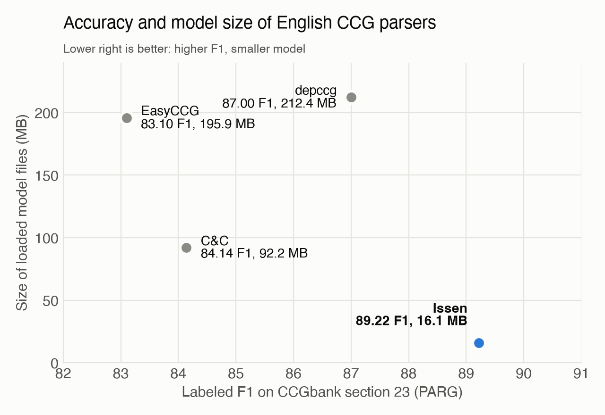

# Issen

Issen is a fast and compact English CCG parser.
A character CNN and a two-layer bidirectional LSTM score the CCG category, head and part of speech of every word, and an A* search implemented in C++ builds the derivation.
Inference runs on the CPU with ONNX Runtime, and the model is about 16 MB in unquantized float32.
Derivations are written as AUTO, JSON or Jigg XML.

## Accuracy and model size



Labeled F1 of CCGbank predicate-argument dependencies (PARG) on section 23, against the total size of the model files each parser loads.
Derivations were converted to dependencies with C&C's `generate` (C&C prints the same dependencies directly), and sentences without a parse count toward the gold dependencies.
The other parsers are depccg 3.0.0 with its basic model (10 category candidates and at most 100,000 search steps), EasyCCG with its default settings, and C&C 1.00 with models 1.02.

## Installation

Python 3.11 or later and a C++17 compiler are required; the search is compiled during installation.

```sh
uv add "issen-ccg[infer,morphology] @ git+https://github.com/mathbullet/issen-ccg" --tag v0.1.0
```

`infer` installs ONNX Runtime, and `morphology` installs MorphoDiTa, which produces the lemmas in Jigg output.
`morphology` is not needed if you only use AUTO and JSON.

## Models

The models are not included in the package.
Download the following and pass their paths at run time.

- Issen model: extract `issen-ccg-model-v0.1.0.tar.gz` from [Releases](https://github.com/mathbullet/issen-ccg/releases) and pass the resulting directory to `--model`.
- MorphoDiTa English model (Jigg output only): pass `english-morphium-wsj-140407-no_negation.tagger` from the [distribution ZIP](https://lindat.mff.cuni.cz/repository/server/api/core/bitstreams/46fe97c1-1ea9-4121-a46c-f1ed27c57a50/content) to `--morphodita-model`. This model is distributed under CC BY-NC-SA (non-commercial); see the [MorphoDiTa manual](https://ufal.mff.cuni.cz/morphodita/users-manual) for details.

## Command line

The input has one sentence per line, with tokens separated by spaces.

```sh
echo 'John likes Mary .' | uv run issen-ccg --model issenccg
echo 'The women are sketching houses .' | uv run issen-ccg \
  --model issenccg --format jigg \
  --morphodita-model english-morphium-wsj-140407-no_negation.tagger
```

- `--format` is `auto` (default), `json` or `jigg`. `jigg` requires `--morphodita-model`.
- In Jigg output, each token has the input token as `surf`, the lowercased lemma as `base`, and the part of speech predicted by Issen as `pos`.
- A sentence has 1 to 512 tokens. Sentences of 513 tokens or more are not parsed and are reported as `too_long` failures. Blank lines are skipped.
- `--max-nodes` (default 300,000) and `--timeout-ms` (default 10,000) limit the search. A sentence that reaches a limit gets no derivation and is reported as a `node_limit` or `timeout` failure.
- The exit status is 0 when every sentence is parsed, 3 when some sentences fail, and 2 for invalid arguments or models that cannot be loaded. The results of the parsed sentences are written even when others fail.

## Python

```python
from issen_ccg import load_parser
from issen_ccg.adapters.morphodita import MorphoditaLemmatizer
from issen_ccg.adapters.tree_output import to_jigg

sentences = [("The", "women", "are", "sketching", "houses", ".")]
parser = load_parser("issenccg")
results = parser.parse(sentences)
if results[0].success:
    print(results[0].tree.lexical_categories)

lemmatizer = MorphoditaLemmatizer("english-morphium-wsj-140407-no_negation.tagger")
lemmas = [lemmatizer.lemmatize(tokens) for tokens in sentences]
xml = to_jigg(sentences, results, lemmas_by_sentence=lemmas)
```

An empty sentence raises `ValueError`.

## License

The code is licensed under the MIT License.

The Issen model is distributed under [CC BY-NC 4.0](https://creativecommons.org/licenses/by-nc/4.0/) for non-commercial use only.
It was trained on CCGbank 1.1 (LDC2005T13), with word vectors initialized from GloVe 6B.
Commercial use additionally requires a CCGbank license from the Linguistic Data Consortium.

## Citation

Author: [Hayate Funakura](https://github.com/mathbullet)

If you use Issen in your research, please cite it as follows.

```bibtex
@misc{
  hayate-funakura-2026-issen-ccg,
  title = {{Issen: A Fast and Compact English CCG Parser}},
  author = {Hayate Funakura},
  year = {2026},
  publisher = {GitHub},
  journal = {GitHub repository},
  howpublished = {\url{https://github.com/mathbullet/issen-ccg}},
  url = {https://github.com/mathbullet/issen-ccg},
}
```
